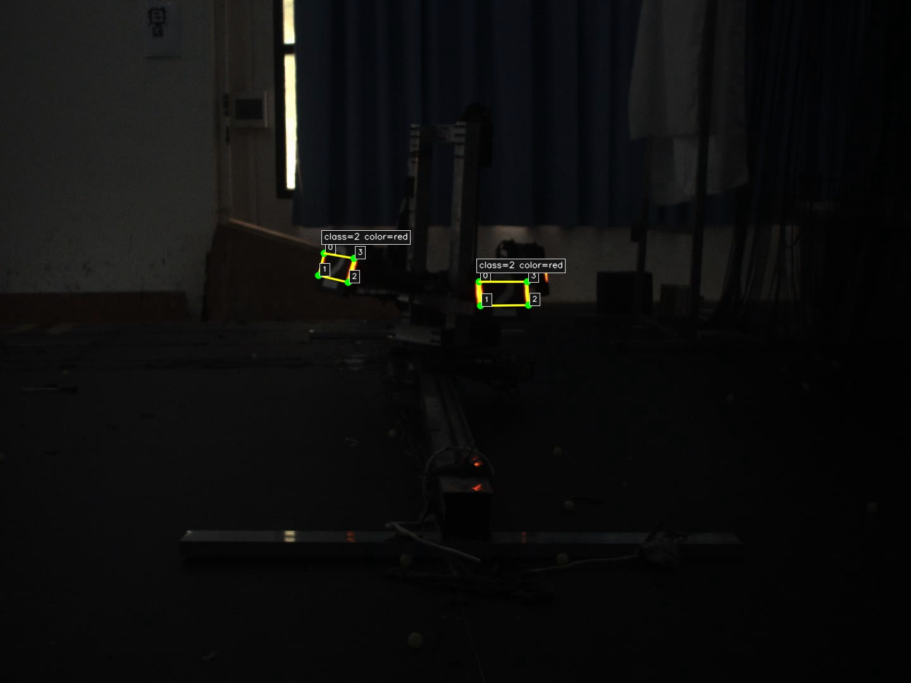
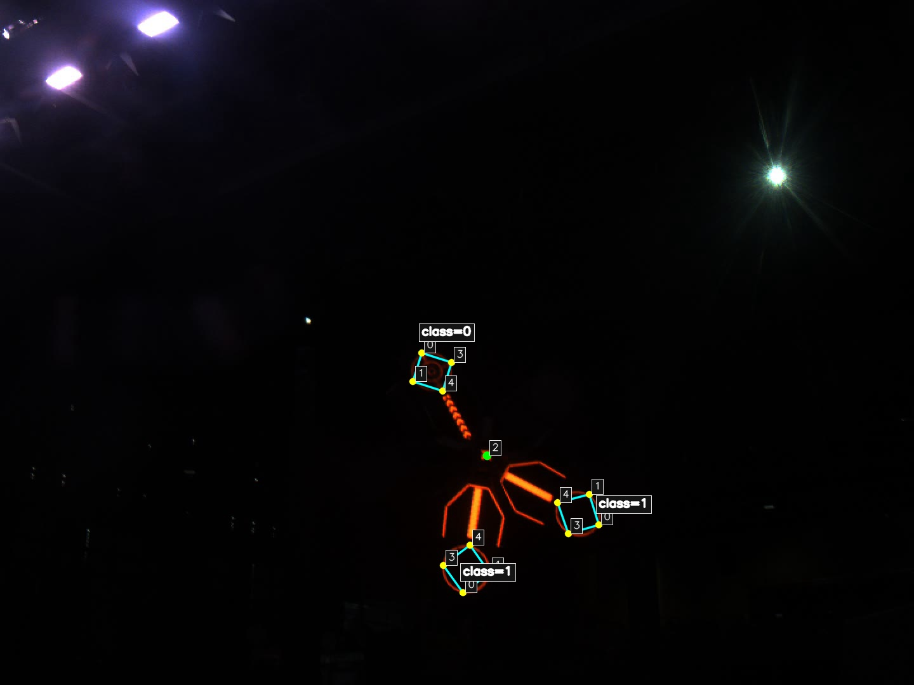
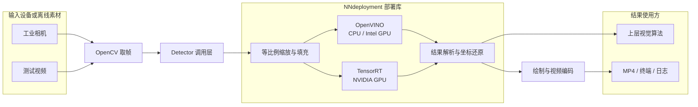
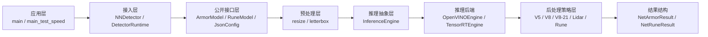
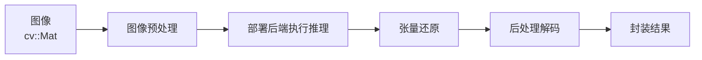

# NNdeployment｜RoboMaster 视觉模型统一部署库

写在前面：当前的readme尚不完善，许多测试数据待补充，细节还不够完善，预计会在2-3天内完成补丁，不便之处请多谅解。着急使用的同学可以直接参考src/core/NNdeployment中的README，调用interface中的接口直接使用，请注意异步推理的前1/3张图片为空图，如果使用RobotPilots战队的自瞄开源框架，也可以直接使用src中的detector插件。

> [!IMPORTANT]
> 本项目主体为 `src/core/algorithm/NNdeployment`。该目录中的部署库代码暂按原有实现维护；`src/app_plugin/detector` 仅提供公开接口的最小接入示例，不包含相机驱动、串口通信、目标预测、弹道解算或机器人控制系统，但符合RobotPilots战队视觉组代码框架开源。本节同步自项目的 [RoboMaster RobotPilots战队-视觉模型统一部署库与识别模型开源](https://bbs.robomaster.com/article/1942761?source=4)。。

`NNdeployment` 是面向 RoboMaster 视觉任务的 C++ 网络部署库。项目以统一接口封装模型预处理、推理与后处理，当前支持 V5/V8 装甲板四关键点、雷达四关键点和能量机关五关键点结果解析，可在构建时选择 OpenVINO 或 TensorRT 推理后端。

仓库提供模型、测试视频、JSON 配置、三模型综合演示和性能测试程序，可在没有相机、串口和下位机的环境中完成离线复现。默认示例使用 OpenVINO，并将 V5 装甲板、V8 装甲板和能量机关的可视化结果分别写入视频文件，适合桌面环境、SSH 和容器运行。


## 目录

- [1. 环境、编译与快速运行](#1-环境编译与快速运行)
- [2. 核心特性](#2-核心特性)
- [3. 软件功能](#3-软件功能)
- [4. 开源模型与测试视频](#4-开源模型与测试视频)
- [5. 效果展示与定量分析](#5-效果展示与定量分析)
- [6. 系统设计](#6-系统设计)
- [7. 算法原理](#7-算法原理)
- [8. 接口与配置](#8-接口与配置)
- [9. 目录结构](#9-目录结构)
- [10. 参考与许可证](#10-参考与许可证)

## 1. 环境、编译与快速运行

### 1.1 环境与依赖

| 依赖 | 要求 | 用途 |
| --- | --- | --- |
| Linux | x86_64；已验证 Ubuntu 22.04 | `/proc/self/exe` 路径解析与运行环境 |
| C++ 编译器 | 支持 C++20 | 编译全部目标 |
| CMake | 3.22 或更高版本 | 工程配置与构建 |
| OpenCV | `core`、`imgproc`、`dnn`、`videoio`、`highgui` | 图像、后处理、视频与可选 GUI |
| OpenVINO | C++ Runtime | 默认推理后端 |
| OpenVINO Benchmark Tool | `benchmark_app` 位于 `PATH` | `main_test_speed` 官方性能测试 |
| CUDA Toolkit | 与 TensorRT 匹配 | TensorRT 构建与运行 |
| TensorRT | 提供 `NvInfer.h` 与 `nvinfer` | 可选 NVIDIA GPU 后端 |

硬件与运行环境说明：

- OpenVINO 可运行于受支持的 CPU 或 Intel GPU；仓库 JSON 默认选择 `GPU`。
- 仅有 CPU 的设备可把对应 JSON 节点的 `device` 改为 `CPU`。
- TensorRT 后端要求 NVIDIA GPU、兼容驱动、CUDA Toolkit 与 TensorRT。
- 运行随仓示例不需要工业相机、串口、下位机或云台。
- TensorRT 序列化引擎通常与 GPU 架构、CUDA 和 TensorRT 版本绑定，环境变化后应从 ONNX 重新生成兼容引擎。

### 1.2 安装基础工具、OpenCV 与 OpenVINO

以下命令面向 **Ubuntu 22.04 x86_64**。先安装编译工具：

```bash
sudo apt update
sudo apt install -y \
  build-essential cmake ninja-build pkg-config \
  git curl wget gnupg
```

#### OpenCV（推荐：Ubuntu APT）

本项目只依赖 OpenCV 的 C++ 开发库，Ubuntu 22.04 仓库中的 `libopencv-dev` 已包含构建所需的头文件、共享库和 CMake 配置：

```bash
sudo apt install -y libopencv-dev
pkg-config --modversion opencv4
```

若第二条命令能输出 OpenCV 版本号，即可继续构建本项目。这是本项目推荐的安装方式。

#### OpenCV（可选：从源码构建）

只有需要固定 OpenCV 版本或自定义编译选项时才使用此方式；请不要再同时安装 APT 版本，以免 CMake 找到错误的 OpenCV。下面以 OpenCV 4.10.0 为例，仅构建本项目需要的模块并启用视频编解码与 GUI 支持：

```bash
sudo apt install -y \
  libgtk-3-dev \
  libavcodec-dev libavformat-dev libavutil-dev libswscale-dev libavdevice-dev \
  libjpeg-dev libpng-dev libtiff-dev

git clone --depth 1 --branch 4.10.0 https://github.com/opencv/opencv.git

cmake -S opencv -B opencv-build -G Ninja \
  -DCMAKE_BUILD_TYPE=Release \
  -DCMAKE_INSTALL_PREFIX=/usr/local \
  -DBUILD_LIST=core,imgproc,dnn,videoio,highgui,imgcodecs \
  -DWITH_FFMPEG=ON \
  -DWITH_GTK=ON \
  -DBUILD_TESTS=OFF \
  -DBUILD_PERF_TESTS=OFF \
  -DBUILD_EXAMPLES=OFF \
  -DOPENCV_GENERATE_PKGCONFIG=ON
cmake --build opencv-build -j"$(nproc)"
sudo cmake --install opencv-build
sudo ldconfig
pkg-config --modversion opencv4
```

更多编译选项见 [OpenCV 官方 Linux 安装文档](https://docs.opencv.org/4.x/d7/d9f/tutorial_linux_install.html)。

#### OpenVINO 2025.4.1（Ubuntu APT）

推荐按照 [OpenVINO 官方安装向导（Linux / APT / 2025.4.1）](https://docs.openvino.ai/2026/get-started/install-openvino.html?PACKAGE=OPENVINO_BASE&VERSION=v_2025_4_1&OP_SYSTEM=LINUX&DISTRIBUTION=APT) 配置 Intel APT 源并安装 C/C++ Runtime，此处仅以个人构建仓库时的命令举例：

```bash
wget https://apt.repos.intel.com/intel-gpg-keys/GPG-PUB-KEY-INTEL-SW-PRODUCTS.PUB
sudo gpg --output /etc/apt/trusted.gpg.d/intel.gpg \
  --dearmor GPG-PUB-KEY-INTEL-SW-PRODUCTS.PUB

echo "deb https://apt.repos.intel.com/openvino ubuntu22 main" | \
  sudo tee /etc/apt/sources.list.d/intel-openvino.list

sudo apt update
apt-cache search openvino
sudo apt install -y openvino-2025.4.1
apt list --installed 2>/dev/null | grep openvino
```

若 Intel APT 源不再提供该补丁版本，可用 `apt-cache search openvino` 查看可用版本，并安装同一 2025.4 系列的包。APT 安装会把 OpenVINO 的 CMake 配置安装到系统路径，通常无需执行 `setupvars.sh`；只有改用官方归档包时，才需要在配置本项目之前执行归档目录中的 `setupvars.sh`。

仓库配置默认使用 Intel GPU。OpenVINO Runtime 之外还必须正确安装 Intel OpenCL / Level Zero 图形计算驱动；请先按 [OpenVINO 官方 Intel GPU 配置文档](https://docs.openvino.ai/2026/get-started/install-openvino/configurations/configurations-intel-gpu.html) 为具体 GPU 和内核版本配置驱动源。

可选地构建官方 C++ 示例，检查编译器能否找到 OpenVINO：

```bash
/usr/share/openvino/samples/cpp/build_samples.sh
```

性能测试程序还要求 `benchmark_app` 位于 `PATH`，可在构建本项目前检查：

```bash
command -v benchmark_app
```

Benchmark Tool 的参数说明见 [OpenVINO Benchmark Tool 文档](https://docs.openvino.ai/2025/get-started/learn-openvino/openvino-samples/benchmark-tool.html)。

### 1.3 构建 OpenVINO 版本

在仓库根目录执行：

```bash
cmake -S . -B build \
  -DNETLIB_ENABLE_TENSORRT=OFF \
  -DCMAKE_BUILD_TYPE=Release
cmake --build build -j
```

或直接使用 VSCODE 的 `cmake` 插件，编译后选择综合演示 `main` 和性能测试 `main_test_speed`运行（推荐）。

生成的共享库位于 `build/lib`，综合演示 `main` 和性能测试 `main_test_speed` 位于 `build/bin`。

### 1.4 构建 TensorRT 版本（可选）

```bash
cmake -S . -B build-trt \
  -DNETLIB_ENABLE_TENSORRT=ON \
  -DCMAKE_BUILD_TYPE=Release
cmake --build build-trt -j
```

该选项会以 TensorRT 替代 OpenVINO 构建 `NNdeployment_lib`，并非在同一库中同时启用两个后端。当前 detector 示例的 JSON、模型目录与视频流程按 OpenVINO 配置；验证 TensorRT 时应通过公开接口传入兼容的 `.trt` 引擎路径、`sync` 模式和 `tensorrt` 后端。

### 1.5 快速运行

综合演示：

```bash
./build/bin/main
```

`main` 在一次运行中完成三个模型的离线演示：`armor_v5` 和 `armor_v8` 分别处理完整的 `测试视频/中距离陀螺.avi`，`rune_detect` 处理完整的 `测试视频/符.avi`。三个结果视频分别写入：

- `build/results/main/armor_v5_result.mp4`
- `build/results/main/armor_v8_result.mp4`
- `build/results/main/rune_result.mp4`

终端同时输出各模型处理的帧数与结果路径。

性能测试：

```bash
./build/bin/main_test_speed
```

当前测试程序依次读取 `armor_v8`、`armor_v5` 和 `rune_detect` 配置，并使用相应测试视频的首帧分别连续推理 2000 次，输出部署库各阶段统计；随后使用相同模型、设备和推理模式运行 20 秒 `benchmark_app`。结果追加写入 `build/bin/network_mpt.log`。

程序会检查 JSON、模型、视频、画面尺寸、FPS 与视频写入器；失败时打印解析后的路径并返回非零状态。输入视频 FPS 无效时，输出视频回退为 30 FPS。

示例默认注释 `cv::imshow` 与 `cv::waitKey`，无需图形界面。桌面环境中可在 `main.cpp` 取消对应注释并重新构建，此时会弹出实时窗口演示；按 `Esc` 结束当前视频循环。

## 2. 核心特性

- **统一任务接口**：通过 `ArmorModel` 和 `RuneModel` 输出原图坐标系下的结构化结果，上层代码无需解析推理张量。
- **输出形状自动识别**：`postprocess_mode=auto` 时根据模型输出张量形状选择对应后处理器，减少模型替换时的重复配置。
- **双推理后端**：默认使用 OpenVINO；具备 NVIDIA CUDA 与 TensorRT 环境时可构建 TensorRT 后端。
- **同步与流水推理**：OpenVINO 后端支持 `sync`、双请求 `async` 和四请求 `async4`，异步请求各自持有预处理缓冲区。
- **单一配置来源**：模型路径、推理模式、后端、设备、置信度阈值与后处理模式集中在 JSON 中维护，更换模型无需重新编译，修改 JSON 文件即可。
- **无硬件复现**：随仓视频和模型可直接驱动三模型综合演示和性能测试，不依赖相机或机器人硬件。

## 3. 软件功能

| 任务 | 调用入口 | 返回值 |
| --- | --- | --- |
| Armor | `ArmorModel::netProcess(image, my_color)` | `std::vector<NetArmorResult>` |
| Rune | `RuneModel::netProcess(image)` | `std::vector<NetRuneResult>` |

`ArmorModel::netProcess` 接收一帧 `cv::Mat` 图像和一个 `int` 整数表示己方颜色标识 `my_color`，返回当前帧中全部有效装甲板结果。调用时 `my_color=1` 表示我方为蓝色，`my_color=0` 表示我方为红色，部署库据此过滤友方结果；离线演示传入 `2`，保留双方颜色用于检查模型输出。

`NetArmorResult` 的成员如下：

| 成员 | 类型 | 含义 |
| --- | --- | --- |
| `points` | `std::vector<cv::Point2d>` | 原图像素坐标系下的四个角点，顺序为左上、左下、右下、右上 |
| `armor_id` | `int` | 装甲板类别 ID，与开源模型的 Class ID 定义一致 |
| `color_id` | `int` | 后处理后的颜色 ID；当前装甲板结果中 `0` 为蓝色、`1` 为红色 |
| `size` | `int` | 装甲板尺寸，`0` 为小装甲板、`1` 为大装甲板 |
| `score` | `double` | 检测结果置信度 |
| `class_name` | `std::string` | `armor_id` 对应的类别名称 |
| `color_name` | `std::string` | `color_id` 对应的颜色名称 |



`RuneModel::netProcess` 接收一帧 `cv::Mat` 图像，返回当前帧中全部有效能量机关结果。五个关键点依次为 `top`、`left`、`R`、`right`、`bottom`，即第 0、1、3、4 号点为符的逆时针四个角点，第 2 号点为符叶中心 R 标点。

`NetRuneResult` 的成员如下：

| 成员 | 类型 | 含义 |
| --- | --- | --- |
| `points` | `std::vector<cv::Point2d>` | 原图像素坐标系下的五个关键点，顺序为 `top`、`left`、`R`、`right`、`bottom` |
| `top`、`left`、`right`、`bottom` | `cv::Point2d` | 四个符叶角点的同名便捷访问字段 |
| `point_R` | `cv::Point2d` | 符叶中心 R 标点的便捷访问字段 |
| `class_id` | `int` | 能量机关激活状态的类别 ID |
| `score` | `double` | 检测结果置信度 |
| `class_name` | `std::string` | `class_id` 对应的类别名称 |



当画面中没有满足阈值的目标时，两种接口均返回空 `vector`，不代表推理调用失败。

## 4. 开源模型与测试视频

### 4.1 装甲板四关键点模型

仓库面向 RoboMaster 自瞄任务提供 `Infantry-v5n-20250725` 与 `Infantry-v8n-20260726` 两套轻量化装甲板四关键点模型。两套模型分别采用 YOLOv5n 与 YOLOv8n-Pose 骨干，并针对装甲板任务重新设计检测头；单次推理同时给出四个角点、装甲板类别和颜色，避免传统“目标检测 + 数字分类”多阶段流程的重复计算，结果可直接用于姿态解算、目标筛选和运动预测。

| 模型 | 网络与张量 | 主要特点 | 随仓格式 |
| --- | --- | --- | --- |
| `Infantry-v5n-20250725` | 输入 `1×3×640×640`；输出 `1×25200×22` | 推理速度更快，具有较好的近、中距离识别与分类能力| OpenVINO FP16 |
| `Infantry-v8n-20260726` | 输入 `1×3×480×640`；输出 `1×21×6300` | 边缘召回率与单灯条识别能力更强，特化前哨站识别并支持近距离基地、白色装甲板识别；分类能力略弱且速度稍慢 | ONNX FP16、OpenVINO FP16 |

`Infantry-v5n-20250725` 的每个候选包含 22 个数值：

- `0～7`：4 个关键点的 `(x, y)` 坐标，共 8 个数值；
- `8`：候选目标总体置信度（logit输出），部署端会进行 Sigmoid 归一化；
- `9～12`：蓝、红、白、紫 4 种颜色的分支得分（Sigmoid输出）；
- `13～21`：9 种装甲板类别的分支得分（Sigmoid输出）。

`Infantry-v8n-20260726` 的每个候选由 21 个通道描述：

- `0～3`：蓝、红、白、紫 4 种颜色的分支得分（Sigmoid输出）；
- `4～12`：9 种装甲板类别的分支得分（Sigmoid输出）；
- `13～20`：4 个关键点的 `(x, y)` 坐标，共 8 个数值。

两套模型均保留 9 类装甲板和 4 种颜色的输出契约；经部署库完成缩放与填充的逆变换后，关键点统一表示为输入 `cv::Mat` 的原图像素坐标。

| Class ID | 类别 |
| ---: | --- |
| 0 | 哨兵 |
| 1 | 英雄 |
| 2 | 工程 |
| 3 | 3 号步兵 |
| 4 | 4 号步兵 |
| 5 | 5 号步兵（`v8n-20260726` 不再识别） |
| 6 | 前哨站 |
| 7 | 基地（底部） |
| 8 | 基地（顶部） |

| Color ID | 颜色 |
| ---: | --- |
| 0 | 蓝色 |
| 1 | 红色 |
| 2 | 白色 |
| 3 | 紫色（`v8n-20260726` 不再识别） |

需要特别说明的是：`Infantry-v5n-20250725` 训练时（2025年）未包含兑换站，实际使用中可能误识别己方兑换站，应结合正确的部署与目标筛选降低影响；且该模型本身并不能很好识别白色和紫色，如果有白色装甲板识别需要，请使用`Infantry-v8n-20260726`。

能量机关模型 `Rune-v8n-fp16-20260624` 和 装甲板模型 `Infantry-v8n-20260726` 同时提供 ONNX FP16 与 OpenVINO FP16 文件。其中 `Rune-v8n-fp16-20260624` 已在 [RuneDetectionModel开源仓库](https://github.com/SZURPVision/RuneDetectionModel) 和 [RoboMaster RobotPilots战队-能量机关五点识别模型](https://bbs.robomaster.com/article/1939101?source=4) 中单独开源，本仓库负责统一部署、五关键点解码与结构化结果封装。

### 4.2 测试视频

以下视频随仓提供，用于模型效果查看、综合演示或扩展离线验证：

| 文件 | 用途 |
| --- | --- |
| `装甲板.mp4` | 装甲板模型基础功能测试 |
| `符.avi` | 能量机关基础功能测试 |
| `近距离上下陀螺.avi` | 近距离上下旋转运动 `armor` 一致性测试 |
| `近距离陀螺.avi` | 近距离旋转运动 `armor` 一致性测试 |
| `中距离陀螺.avi` | 中距离旋转运动 `armor` 一致性测试 |
| `远处旋转平移.avi` | 远距离旋转与平移运动 `armor` 一致性测试 |
| `远距离平移.avi` | 远距离平移运动 `armor` 一致性测试 |
| `远距离陀螺.avi` | 远距离旋转运动 `armor` 一致性测试 |

`装甲板.mp4` 和 `符.avi` 主要用于检测部署库功能是否完整，通过检查输出视频可以确认部署库是否正确部署。随仓附加6个测试视频，用于PNP一致性检测，相机内参与畸变参数见仓库（待补充）

## 5. 效果展示与定量分析

### 5.1 性能快照

以下结果取自仓库根目录 `network_mpt.log`。测试设备为 Intel NUC13（Core i7 / i5、32 GB 双通道内存），使用 OpenVINO GPU（Intel iGPU）推理。测试的部署配置见表格中的 `推理模式`，匹配国赛时的真实需求。

| 设备 | 模型 | 推理模式 | 平均预处理 | 平均推理 | 平均后处理 | 平均总耗时 | 端到端 FPS |
| --- | --- | --- | ---: | ---: | ---: | ---: | ---: |
| Intel NUC13<br>Core i7 / i5，32 GB 双通道 | Armor V5-20250725 | `async` | 0.995 | 4.289 | 0.273 | 5.557 | 179.95 |
| Intel NUC13<br>Core i7 / i5，32 GB 双通道 | Armor V8-20260726 | `async` | 0.691 | 5.771 | 0.098 | 6.561 | 152.43 |
| Intel NUC13<br>Core i7 / i5，32 GB 双通道 | Rune V8-20260624 | `sync` | 0.518 | 7.407 | 0.017 | 7.943 | 125.90 |

结果随 OpenVINO 版本、Intel GPU 驱动、设备功耗、温度和系统负载变化。

## 6. 系统设计

### 6.1 软件与硬件系统框图



图中从“等比例缩放与填充”到“结果解析与坐标还原”的完整区域属于 `NNdeployment` 部署库；OpenVINO 与 TensorRT 是其中可选的推理后端。相机、上层算法和控制器不属于本仓库。随仓示例使用视频文件代替相机输入，并将检测结果输出到文件与终端。

### 6.2 软件分层架构



| 层级 | 主要职责 | 主要位置 |
| --- | --- | --- |
| 应用层 | 组织视频循环、性能测试和结果输出 | `src/app_plugin/detector/examples`、`tests` |
| 接入层 | 校验输入、选择任务、解析项目路径、绘制结果 | `src/app_plugin/detector` |
| 公开接口层 | 隐藏内部实现并提供稳定结果结构 | `NNdeployment/interface` |
| 预处理层 | 保持长宽比缩放、填充并记录逆变换参数 | `src/preprocess` |
| 推理层 | 管理模型、张量、同步或异步请求及设备资源 | `src/inference` |
| 后处理层 | 解析候选、阈值筛选、NMS、颜色过滤与坐标还原 | `src/postprocess` |
| 性能层 | 记录各阶段耗时并调用官方基准工具 | `src/performance` |

## 7. 算法原理

部署库处理一帧图像时遵循以下主流程：



输入 `cv::Mat` 首先被缩放、填充并转换为后端所需张量；OpenVINO 或 TensorRT 执行推理后，输出张量被恢复为后处理器可访问的二维布局，再完成阈值筛选、类别与关键点解码、候选抑制及坐标逆变换，最终封装为 `NetArmorResult` 或 `NetRuneResult`。

### 7.1 模型输出契约与后处理器自动选择

模型决定输入尺寸和输出张量契约，后处理器负责把不同契约统一为稳定的公开结果结构。`postprocess_mode=auto` 时，库在模型初始化阶段根据输出张量的二维形状选择解析策略：

| 输出形状 | 后处理器 | 结果契约 |
| --- | --- | --- |
| `25200 × 22` | V5 装甲板 | 4 关键点、4 色、9 类 |
| `25 × 6300` | V8 装甲板 | 4 关键点、4 色、9 类 |
| `21 × 6300` | V8-21 装甲板 | 4 关键点、4 色、9 类 |
| `18 × 6300` | 能量机关 | 5 关键点、3 类 |

当前开源的 `Infantry-v5n-20250725` 对应 `25200 × 22` 契约，`Infantry-v8n-20260726` 对应 `21 × 6300` 契约，`Rune-v8n-fp16-20260624` 对应 `18 × 6300` 契约。未知形状不会被猜测解析，而是直接抛出异常。

### 7.2 图像预处理：等比例缩放与坐标还原

设原图尺寸为 $W_o \times H_o$，模型输入尺寸为 $W_t \times H_t$。预处理使用统一缩放比例

$$
s = \min\left(\frac{W_t}{W_o},\frac{H_t}{H_o}\right)
$$

得到缩放尺寸

$$
W_r=\operatorname{round}(sW_o),\qquad H_r=\operatorname{round}(sH_o).
$$

当长宽比不一致时，图像居中填充为模型尺寸，填充值为 BGR `(124, 124, 124)`。设左、上填充量为 $p_x,p_y$，模型输出关键点 $(x_m,y_m)$ 通过

$$
x_o=\frac{x_m-p_x}{s},\qquad y_o=\frac{y_m-p_y}{s}
$$

还原到原图坐标系。还原结果超出原图边界时，该候选会被丢弃。OpenVINO 后端随后完成 `u8 → f32`、`BGR → RGB`、除以 `255` 的归一化以及 `NHWC → NCHW` 布局转换；TensorRT 后端通过 OpenCV DNN 构造归一化 blob。

### 7.3 同步与异步推理

`sync` 模式完成当前帧推理后立即返回当前帧结果，适合关注单帧延迟的任务。`async` 使用两个请求槽位，一边提交新帧，一边等待并读取上一槽位结果；`async4` 以相同方式轮转四个请求。异步模式通过并行重叠提高连续输入吞吐，但返回结果相对输入存在流水线延迟，调用方必须维护帧与结果的对应关系。

以装甲板任务使用的 `async` 模式为例：部署库初始化时会向请求槽位中传入一张空图片作为预热，当外部传入一张图片（image1）时，将会返回空图的识别结果；当外部传入第二张图片（image2）时，将会返回第一张图片（image1）的识别结果。部署库保证传入顺序和输出顺序一致。

### 7.4 后处理解码与非极大值抑制

张量还原后，对应后处理器按照模型契约读取类别、颜色、置信度与关键点，完成阈值筛选和坐标逆变换，再抑制重复候选。

装甲板和雷达将关键点外接矩形交给 OpenCV NMS。两个候选框 $A,B$ 的交并比为

$$
\operatorname{IoU}(A,B)=\frac{|A\cap B|}{|A|+|B|-|A\cap B|}.
$$

候选按置信度保留，并抑制高度重叠的低分框。当前装甲板默认 NMS 阈值为 `0.2`。

能量机关使用中心距离抑制：跳过 `R` 点，对 `top / left / right / bottom` 四点取均值得到候选中心；同一类别组内按置信度降序保留结果。未激活与小符激活候选使用 `100 px` 中心距离阈值，大符激活候选使用其三分之一。每个能量机关候选还要求至少三个关键点置信度大于 `0.8`。

更具体的解码规则详见 `src/core/algorithm/NNdeployment/src/postprocess/network_postprocess.cpp`

### 7.5 创新性与优势

1. **模型差异收敛在部署层**：上层只接触装甲板与能量机关两种稳定结果结构，V5/V8 张量布局、关键点索引和类别解析由独立后处理器承担。
2. **用张量签名自动匹配后处理**：部署库依据输出形状区分已支持的模型契约，并在形状未知时直接报错，避免模型与后处理器静默错配。
3. **异步缓冲区生命周期与推理请求绑定**：双请求和四请求模式为每个槽位保留成员级图像缓冲区，防止异步推理仍在读取输入时局部 `cv::Mat` 已被释放。
4. **同一配置贯穿演示与测试**：示例程序和性能程序从相同 JSON 节点读取模型、设备与推理模式，降低重复默认值造成的复现偏差。
5. **兼顾快速接入与离线验证**：公开模型接口可嵌入上层视觉系统，随仓视频、绘制函数和结果导出又能在无机器人硬件时独立检查完整检测链路。

## 8. 接口与配置

### 8.1 最小调用示例

```cpp
#include "network_deployment_interface.hpp"

// 构建配置文件，参数分别为：json文件相对地址，模型配置键名，模型相对地址前缀
JsonConfig armor_config{
    "src/app_plugin/detector/config/detect.json",
    "armor_v8",
    "所有模型/openvino"};
// 创建推理类
ArmorModel armor_model(armor_config);
// 调用接口获取装甲板识别结果
std::vector<NetArmorResult> armors = armor_model.netProcess(frame, 1);


// Rune同理
JsonConfig rune_config{
    "src/app_plugin/detector/config/detect.json",
    "rune_detect",
    "所有模型/openvino"};
RuneModel rune_model(rune_config);
std::vector<NetRuneResult> runes = rune_model.netProcess(frame);
```

无有效检测结果时，模型接口返回空 `vector`。

### 8.2 JSON 配置

配置文件为 [`src/app_plugin/detector/config/detect.json`](src/app_plugin/detector/config/detect.json)：

| 节点 | 用途 | 当前配置 |
| --- | --- | --- |
| `armor_v8` | V8 装甲板演示与性能测试 | `async / openvino / GPU / auto / 0.5` |
| `armor_v5` | V5 装甲板演示与性能测试 | `async / openvino / GPU / auto / 0.5` |
| `rune_detect` | 能量机关演示与性能测试 | `sync / openvino / GPU / auto / 0.5` |

| 字段 | 含义 |
| --- | --- |
| `xml` | 相对于 `JsonConfig.model_folder` 的模型路径 |
| `infer_mode` | `sync`、`async` 或 `async4` |
| `deploy_way` | `openvino` 或 `tensorrt` |
| `postprocess_mode` | `auto` 或显式后处理类型 |
| `device` | OpenVINO 设备名，例如 `CPU` 、 `GPU` 或 `NPU` |
| `score_threshold` | 候选置信度阈值 |

**注意**：模型路径同时被要求出现在 `JsonConfig` 的第三个参数中和 `JSON` 配置的第一个参数中，两者拼接时才是完整路径。该设计符合RobotPilots算法框架的设计.如果没有特别需要，也可以将`JsonConfig` 的第三个参数设置为空字符串，在`JSON` 配置中填入完整模型路径。

## 9. 目录结构

```text
.
├── CMakeLists.txt                         # 顶层构建入口
├── README.md                              # 项目说明
├── src/
│   ├── core/algorithm/
│   │   ├── CMakeLists.txt
│   │   └── NNdeployment/                  # 网络部署库主体
│   │       ├── interface/                 # 对外公开接口与结果结构
│   │       ├── inc/                       # 内部头文件
│   │       ├── src/
│   │       │   ├── inference/             # OpenVINO / TensorRT 后端
│   │       │   ├── postprocess/           # 各任务后处理器
│   │       │   ├── preprocess/            # 图像缩放与填充
│   │       │   └── performance/           # 性能统计与官方基准封装
│   │       ├── CMakeLists.txt
│   │       └── README.md                  # 部署库内部的接口说明
│   └── app_plugin/detector/               # 最小接入与离线复现层
│       ├── config/detect.json             # 运行配置
│       ├── include/                       # 接入层公开头文件
│       ├── src/                           # 接入层实现
│       ├── examples/main.cpp              # V5、V8 与能量机关综合演示
│       ├── tests/main_test_speed.cpp      # 性能测试
│       └── CMakeLists.txt
├── 所有模型/
│   ├── onnx/                              # 可交换模型
│   ├── openvino/                          # OpenVINO IR（XML + BIN）
│   └── tensorrt/                          # TensorRT 序列化引擎
└── 测试视频/                              # 离线复现素材
```

## 10. 参考与许可证

### 10.1 参考文献

项目文档组织与任务背景参考了以下公开资料。外部项目的实现、数据、图片、性能结论和许可证不自动适用于本仓库。

- [SZURPVision/RP-26Rune 能量机关开源仓库](https://github.com/SZURPVision/RP-26Rune) 与 [RoboMaster RobotPilots战队-能量机关算法开源](https://bbs.robomaster.com/article/1942229?source=1)
- [SZURPVision/RuneDetectionModel 能量机关模型开源仓库](https://github.com/SZURPVision/RuneDetectionModel) 与 [RoboMaster RobotPilots战队-能量机关五点识别模型](https://bbs.robomaster.com/article/1939101?source=4)
- [broalantaps/RobotDetectionModel 2024赛季识别模型开源仓库](https://github.com/broalantaps/RobotDetectionModel) 与 [RoboMaster RobotPilots战队-24赛季识别模型](https://bbs.robomaster.com/article/54091?source=4)

第三方运行依赖分别受其自身许可约束，包括 [OpenCV](https://github.com/opencv/opencv/blob/4.x/LICENSE)、[OpenVINO](https://github.com/openvinotoolkit/openvino/blob/master/LICENSE)、[CUDA Toolkit](https://docs.nvidia.com/cuda/eula/index.html) 与 [TensorRT](https://docs.nvidia.com/deeplearning/tensorrt/latest/reference/eula.html)。

### 10.2 致谢
感谢2026赛季全体视觉组同学，尤其是梯队队员在数据集上给予我的大力支持，很抱歉今年给你们派了太多数据集，非常感谢你们支持网络组的工作。

感谢段神提供的快速标注的数据集，在分区赛期间提供了关键的基地装甲板。今年请务必继续大力支持27届网络组的数据集工作，劳者多牢。

感谢戴哥给我提供的训练模型上的指导，v8架构的许多改进都是基于您的训练代码的修改思路做出的尝试，也感谢戴哥提供的优质模型为我评判模型功能提供了标准的baseline。同时也感谢聂宇航和舞与萌对改进模型方向上的重大帮助，你们的集思广益很有启发性，今年我会把没完成的尝试写进工作交接里。

感谢陈泓宇组长在我压力最大的时候提供的精神上帮助，没有你我打不到国赛。

感谢自瞄组尤其是哨兵为模型测试提供的反馈意见，抱歉今年的模型总是有问题，感谢你们愿意尝试新模型。

再次感谢各位视觉组同学的大力帮助。

### 10.3 开源许可证

本仓库根目录已提供 [`LICENSE`](LICENSE)，其中声明本项目采用 **MIT License**，版权归 `SZURPVision`（2026）所有。对于由本项目作者持有权利的源码与文档，使用者可以在保留原版权声明和许可声明的前提下使用、复制、修改、合并、发布、分发、再许可或销售副本；软件按“现状”提供，不附带任何明示或默示担保。

仓库中若有单独标注来源或许可证的第三方代码、模型、数据、视频及其他素材，则仍适用其各自的许可和再分发条件；根目录 MIT License 不会取代第三方权利人的授权要求。OpenCV、OpenVINO、CUDA Toolkit 与 TensorRT 等运行依赖也分别受其自身许可证约束。
