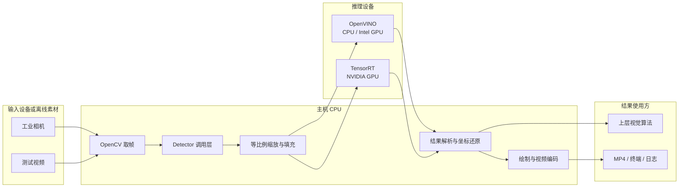
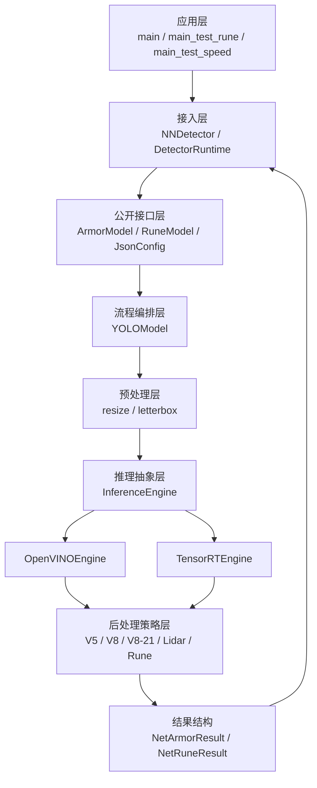
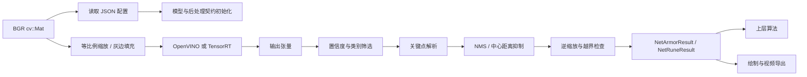

# NNdeployment｜RoboMaster 视觉模型统一部署库

写在前面：当前的readme尚不完善，许多测试数据待补充，细节还不够完善，预计会在2-3天内完成补丁，不便之处请多谅解。着急使用的同学可以直接参考src/core/NNdeployment中的README，调用interface中的接口直接使用，请注意异步推理的前1/3张图片为空图，如果使用RobotPilots战队的自瞄开源框架，也可以直接使用src中的detector插件。


`NNdeployment` 是面向 RoboMaster 视觉任务的 C++ 网络部署库。项目以统一接口封装模型预处理、推理与后处理，当前支持 V5/V8 装甲板四关键点、雷达四关键点和能量机关五关键点结果解析，可在构建时选择 OpenVINO 或 TensorRT 推理后端。

仓库提供模型、测试视频、JSON 配置、综合演示、能量机关独立测试和性能测试程序，可在没有相机、串口和下位机的环境中完成离线复现。默认示例使用 OpenVINO，并将可视化结果写入视频文件，适合桌面环境、SSH 和容器运行。

> [!IMPORTANT]
> 本项目主体为 `src/core/algorithm/NNdeployment`。该目录中的部署库代码暂按原有实现维护；`src/app_plugin/detector` 仅提供公开接口的最小接入示例，不包含相机驱动、串口通信、目标预测、弹道解算或机器人控制系统，但符合RobotPilots战队视觉组代码框架开源。

## 目录

- [1. 核心特性](#1-核心特性)
- [2. 软件功能](#2-软件功能)
- [3. 效果展示与定量分析](#3-效果展示与定量分析)
- [4. 系统设计](#4-系统设计)
- [5. 算法原理](#5-算法原理)
- [6. 环境与依赖](#6-环境与依赖)
- [7. 编译与安装](#7-编译与安装)
- [8. 快速运行](#8-快速运行)
- [9. 接口与配置](#9-接口与配置)
- [10. 目录结构](#10-目录结构)
- [11. 测试与复现](#11-测试与复现)
- [12. Roadmap](#12-roadmap)
- [13. 常见问题](#13-常见问题)
- [14. 参考与许可证](#14-参考与许可证)

## 1. 核心特性

- **统一任务接口**：通过 `ArmorModel` 和 `RuneModel` 输出原图坐标系下的结构化结果，上层代码无需解析推理张量。
- **多种输出契约**：覆盖 V5 装甲板、两种 V8 装甲板、雷达和能量机关五关键点后处理。
- **输出形状自动识别**：`postprocess_mode=auto` 时根据模型输出张量形状选择对应后处理器，减少模型替换时的重复配置。
- **双推理后端**：默认使用 OpenVINO；具备 NVIDIA CUDA 与 TensorRT 环境时可构建 TensorRT 后端。
- **同步与流水推理**：OpenVINO 后端支持 `sync`、双请求 `async` 和四请求 `async4`，异步请求各自持有预处理缓冲区。
- **单一配置来源**：模型路径、推理模式、后端、设备、置信度阈值与后处理模式集中在 JSON 中维护。
- **无硬件复现**：随仓视频和模型可直接驱动综合演示、独立检测和性能测试，不依赖相机或机器人硬件。
- **无界面运行**：默认不创建 GUI 窗口，结果写入 MP4，便于在 SSH、容器和无桌面服务器中验证。

## 2. 软件功能

| 任务 | 调用入口 | 返回值 |
| --- | --- | --- |
| Armor | `ArmorModel::netProcess(image, my_color)` | `std::vector<NetArmorResult>` |
| Rune | `RuneModel::netProcess(image)` | `std::vector<NetRuneResult>` |

`ArmorModel::netProcess` 接收一帧 `cv::Mat` 图像和己方颜色标识 `my_color`，返回当前帧中全部有效装甲板结果。每个 `NetArmorResult` 包含原图像素坐标系下的四个关键点，以及装甲板类别、颜色、尺寸、置信度和对应名称。四个关键点依次为左上、左下、右下、右上。

装甲板结果中 `color_id=0` 表示蓝色，`color_id=1` 表示红色。调用时 `my_color=1` 表示我方为蓝色，`my_color=0` 表示我方为红色，部署库据此过滤友方结果；离线演示传入 `2`，保留双方颜色用于检查模型输出。


`RuneModel::netProcess` 接收一帧 `cv::Mat` 图像，返回当前帧中全部有效能量机关结果。每个 `NetRuneResult` 包含原图像素坐标系下的五个关键点、激活类别、置信度和类别名称。五个关键点依次为 `top`、`left`、`R`、`right`、`bottom`，即第0，1，3，4号点为符的逆时针四个角点，第2号点为符叶中心R标点，同时可通过结果结构中的同名字段直接访问。


当画面中没有满足阈值的目标时，两种接口均返回空 `vector`，不代表推理调用失败。

## 3. 效果展示与定量分析

### 3.2 性能快照

以下结果来自 Intel NUC13（Core i7 / i5、32 GB 双通道内存）与 Intel Core i7-10700F + NVIDIA GeForce RTX 4090 两套设备。每组端到端结果均连续执行 2000 次，覆盖预处理、模型推理和后处理；端到端 FPS 由三阶段平均总耗时换算，不包含视频解码、结果绘制和视频编码。表中耗时单位统一为毫秒。

| 设备 | 模型 | 平均预处理 | 平均推理 | 平均后处理 | 平均总耗时 | 推理最小 / 最大 | 端到端 FPS | Benchmark 平均延迟 | Benchmark 吞吐量（FPS） |
| --- | --- | ---: | ---: | ---: | ---: | ---: | ---: | ---: | ---: |
| Intel NUC13<br>Core i7 / i5，32 GB 双通道 | Armor V5-20250725 | 0.922 | 2.814 | 2.320 | 6.056 | 0.048 / 12.087 | 165.14 | — | — |
| Intel NUC13<br>Core i7 / i5，32 GB 双通道 | Armor V8-20260511 | 0.737 | 5.700 | 0.399 | 6.836 | 1.799 / 9.737 | 146.28 | — | — |
| Intel NUC13<br>Core i7 / i5，32 GB 双通道 | Armor V8-20260726 | 0.492 | 8.292 | 0.303 | 9.088 | 7.106 / 12.208 | 110.04 | — | — |
| Intel NUC13<br>Core i7 / i5，32 GB 双通道 | Rune V8-20260624 | 0.555 | 7.654 | 0.118 | 8.326 | 6.454 / 12.512 | 120.10 | — | — |
| Intel Core i7-10700F<br>NVIDIA GeForce RTX 4090 | Armor V5-20250725 | 0.331 | 1.134 | 1.168 | 2.633 | 0.008 / 3.039 | 379.73 | 8.87 | 448.64 |
| Intel Core i7-10700F<br>NVIDIA GeForce RTX 4090 | Armor V8-20260511 | 0.251 | 3.144 | 0.277 | 3.671 | 0.007 / 7.011 | 272.38 | 13.93 | 286.28 |
| Intel Core i7-10700F<br>NVIDIA GeForce RTX 4090 | Armor V8-20260726 | 0.255 | 3.152 | 0.237 | 3.643 | 0.007 / 6.855 | 274.51 | 13.68 | 291.26 |
| Intel Core i7-10700F<br>NVIDIA GeForce RTX 4090 | Rune V8-20260624 | 0.272 | 3.681 | 0.077 | 4.030 | 3.630 / 4.366 | 248.16 | 3.75 | 262.70 |

端到端 FPS 与 Benchmark 吞吐量采用不同统计边界，不能直接作为同一指标比较。结果会随推理模式、运行时版本、驱动、设备功耗、温度和系统负载变化。

### 3.3 创新性与优势

1. **模型差异收敛在部署层**：上层只接触装甲板与能量机关两种稳定结果结构，V5/V8 张量布局、关键点索引和类别解析由独立后处理器承担。
2. **用张量签名自动匹配后处理**：部署库依据输出形状区分已支持的模型契约，并在形状未知时直接报错，避免模型与后处理器静默错配。
3. **异步缓冲区生命周期与推理请求绑定**：双请求和四请求模式为每个槽位保留成员级图像缓冲区，防止异步推理仍在读取输入时局部 `cv::Mat` 已被释放。
4. **同一配置贯穿演示与测试**：示例程序和性能程序从相同 JSON 节点读取模型、设备与推理模式，降低重复默认值造成的复现偏差。
5. **兼顾快速接入与离线验证**：公开模型接口可嵌入上层视觉系统，随仓视频、绘制函数和结果导出又能在无机器人硬件时独立检查完整检测链路。

## 4. 系统设计

### 4.1 软件与硬件系统框图



相机、上层算法和控制器不属于本仓库。随仓示例使用视频文件代替相机输入，并将检测结果输出到文件与终端。

### 4.2 软件分层架构



| 层级 | 主要职责 | 主要位置 |
| --- | --- | --- |
| 应用层 | 组织视频循环、性能测试和结果输出 | `src/app_plugin/detector/examples`、`tests` |
| 接入层 | 校验输入、选择任务、解析项目路径、绘制结果 | `src/app_plugin/detector` |
| 公开接口层 | 隐藏内部实现并提供稳定结果结构 | `NNdeployment/interface` |
| 流程编排层 | 读取配置，选择推理引擎与后处理器 | `network_deployment_lib.cpp` |
| 预处理层 | 保持长宽比缩放、填充并记录逆变换参数 | `src/preprocess` |
| 推理层 | 管理模型、张量、同步或异步请求及设备资源 | `src/inference` |
| 后处理层 | 解析候选、阈值筛选、NMS、颜色过滤与坐标还原 | `src/postprocess` |
| 性能层 | 记录各阶段耗时并调用官方基准工具 | `src/performance` |

### 4.3 数据流



## 5. 算法原理

### 5.1 等比例缩放与坐标还原

设原图尺寸为 $W_o \times H_o$，模型输入尺寸为 $W_t \times H_t$。预处理使用统一缩放比例

$$
s = \min\left(\frac{W_t}{W_o},\frac{H_t}{H_o}\right)
$$

得到缩放尺寸

$$
W_r=\operatorname{round}(sW_o),\qquad H_r=\operatorname{round}(sH_o).
$$

当长宽比不一致时，图像居中填充为模型尺寸，填充值为 BGR `(124, 124, 124)`。设左、上填充量为 $p_x,p_y$，模型输出关键点 $(x_m,y_m)$ 通过

$$
x_o=\frac{x_m-p_x}{s},\qquad y_o=\frac{y_m-p_y}{s}
$$

还原到原图坐标系。还原结果超出原图边界时，该候选会被丢弃。OpenVINO 后端随后完成 `u8 → f32`、`BGR → RGB`、除以 `255` 的归一化以及 `NHWC → NCHW` 布局转换；TensorRT 后端通过 OpenCV DNN 构造归一化 blob。

### 5.2 后处理器自动选择

`postprocess_mode=auto` 时，库根据输出张量的二维形状选择解析策略：

| 输出形状 | 后处理器 | 结果契约 |
| --- | --- | --- |
| `25200 × 22` | V5 装甲板 | 4 关键点、4 色、9 类 |
| `25 × 6300` | V8 装甲板 | 4 关键点、4 色、9 类 |
| `21 × 6300` | V8-21 装甲板 | 4 关键点、4 色、5 类 |
| `18 × 6300` | 能量机关 | 5 关键点、3 类 |

未知形状不会被猜测解析，而是抛出异常。雷达后处理需在配置中显式选择 `lidar`，避免与其他四点模型混淆。

### 5.3 置信度、类别与颜色筛选

V5 模型的总体置信度为未归一化值 $z$。实现先把用户阈值 $t\in(0,1)$ 变换为 logit 阈值

$$
z_t=\log\frac{t}{1-t},
$$

在原始输出上完成早期筛选，再用数值稳定的 sigmoid

$$
\sigma(z)=\frac{1}{1+e^{-z}}
$$

得到最终置信度。V8 与能量机关模型直接使用类别分支的最大得分。装甲板候选还会依据 `my_color` 排除友方颜色、排除紫色异常结果，并使用最近五帧中同类别且交并比大于 `0.3` 的结果辅助判断白色装甲板。

### 5.4 冗余候选抑制

装甲板和雷达将关键点外接矩形交给 OpenCV NMS。两个候选框 $A,B$ 的交并比为

$$
\operatorname{IoU}(A,B)=\frac{|A\cap B|}{|A|+|B|-|A\cap B|}.
$$

候选按置信度保留，并抑制高度重叠的低分框。当前装甲板默认 NMS 阈值为 `0.2`。

能量机关使用中心距离抑制：跳过 `R` 点，对 `top / left / right / bottom` 四点取均值得到候选中心；同一类别组内按置信度降序保留结果。未激活与小符激活候选使用 `100 px` 中心距离阈值，大符激活候选使用其三分之一。每个能量机关候选还要求至少三个关键点置信度大于 `0.8`。

### 5.5 同步与异步推理

`sync` 模式完成当前帧推理后立即返回当前帧结果，适合关注单帧延迟的任务。`async` 使用两个请求槽位，一边提交新帧，一边等待并读取上一槽位结果；`async4` 以相同方式轮转四个请求。异步模式通过并行重叠提高连续输入吞吐，但返回结果相对输入存在流水线延迟，调用方必须维护帧与结果的对应关系。

每个异步请求绑定独立的成员级预处理缓冲区，使输入数据的生命周期覆盖推理请求执行过程。双请求模式在初始化时预热一个槽位，四请求模式预热三个槽位，因此启动阶段返回的是预热请求结果。

## 6. 环境与依赖

### 6.1 软件依赖

| 依赖 | 要求 | 用途 |
| --- | --- | --- |
| Linux | x86_64；已验证 Ubuntu 22.04 | `/proc/self/exe` 路径解析与运行环境 |
| C++ 编译器 | 支持 C++20 | 编译全部目标 |
| CMake | 3.22 或更高版本 | 工程配置与构建 |
| OpenCV | `core`、`imgproc`、`dnn`、`videoio`、`highgui` | 图像、后处理、视频与可选 GUI |
| OpenVINO | C++ Runtime | 默认推理后端 |
| OpenVINO Benchmark Tool | `benchmark_app` 位于 `PATH` | `main_test_speed` 官方性能测试 |
| CUDA Toolkit | 与 TensorRT 匹配 | TensorRT 构建与运行 |
| TensorRT | 提供 `NvInfer.h` 与 `nvinfer` | 可选 NVIDIA GPU 后端 |

### 6.2 硬件环境

- OpenVINO 可运行于受支持的 CPU 或 Intel GPU；仓库 JSON 默认选择 `GPU`。
- 仅有 CPU 的设备可把对应 JSON 节点的 `device` 改为 `CPU`。
- TensorRT 后端要求 NVIDIA GPU、兼容驱动、CUDA Toolkit 与 TensorRT。
- 运行随仓示例不需要工业相机、串口、下位机或云台。
- TensorRT 序列化引擎通常与 GPU 架构、CUDA 和 TensorRT 版本绑定，环境变化后应从 ONNX 重新生成兼容引擎。

## 7. 编译与安装

### 7.1 安装基础工具

Ubuntu 22.04 可先安装编译工具与 OpenCV：

```bash
sudo apt update
sudo apt install -y build-essential cmake libopencv-dev
```

OpenVINO C++ Runtime 请参考 [OpenVINO Linux APT 安装文档](https://docs.openvino.ai/2025/get-started/install-openvino/install-openvino-apt.html)。使用归档包安装时，构建前加载安装目录中的 `setupvars.sh`。性能测试工具的安装与参数说明见 [OpenVINO Benchmark Tool 文档](https://docs.openvino.ai/nightly/get-started/learn-openvino/openvino-samples/benchmark-tool.html)。

### 7.2 构建 OpenVINO 版本

在仓库根目录执行：

```bash
cmake -S . -B build \
  -DNETLIB_ENABLE_TENSORRT=OFF \
  -DCMAKE_BUILD_TYPE=Release
cmake --build build -j
```

生成的共享库位于 `build/lib`，三个示例程序位于 `build/bin`。

### 7.3 构建 TensorRT 版本

```bash
cmake -S . -B build-trt \
  -DNETLIB_ENABLE_TENSORRT=ON \
  -DCMAKE_BUILD_TYPE=Release
cmake --build build-trt -j
```

该选项会以 TensorRT 替代 OpenVINO 构建 `NNdeployment_lib`，并非在同一库中同时启用两个后端。当前 detector 示例的 JSON、模型目录与视频流程按 OpenVINO 配置；验证 TensorRT 时应通过公开接口传入兼容的 `.trt` 引擎路径、`sync` 模式和 `tensorrt` 后端。

## 8. 快速运行

### 8.1 综合演示

```bash
./build/bin/main
```

程序依次执行：

1. 读取 `测试视频/中距离陀螺.avi` 首帧，以 `armor_detect_outpost` 初始化 V5 异步模型并完成预热与取结果；
2. 以 `armor_detect_aim` 处理完整装甲板视频；
3. 以 `rune_detect` 处理完整 `测试视频/符.avi`；
4. 输出 `build/results/main/armor_v8_result.mp4` 与 `build/results/main/rune_result.mp4`。

### 8.2 独立能量机关测试

```bash
./build/bin/main_test_rune
```

结果写入 `build/results/rune/rune_result.mp4`，终端同时输出输入帧数、输出帧数和检测数量。

### 8.3 性能测试

```bash
command -v benchmark_app
./build/bin/main_test_speed
```

当前测试程序读取 `rune_detect` 配置和 `符.avi` 首帧，连续推理 2000 次并输出部署库各阶段统计，随后使用相同模型、设备和推理模式运行 20 秒 `benchmark_app`。官方基准结果追加写入 `build/bin/network_mpt.log`。

### 8.4 从其他工作目录运行

三个程序都接受可选的仓库根目录参数：

```bash
./build/bin/main /absolute/path/to/deployment_lib
```

程序会检查 JSON、模型、视频、画面尺寸、FPS 与视频写入器；失败时打印解析后的路径并返回非零状态。输入视频 FPS 无效时，输出视频回退为 30 FPS。

### 8.5 可选 GUI

示例默认注释 `cv::imshow` 与 `cv::waitKey`，无需图形界面。桌面环境中可在 `main.cpp` 或 `main_test_rune.cpp` 取消对应注释并重新构建；按 `Esc` 结束当前视频循环。

## 9. 接口与配置

### 9.1 最小调用示例

```cpp
#include "network_deployment_interface.hpp"

JsonConfig armor_config{
    "src/app_plugin/detector/config/detect.json",
    "armor_detect_aim",
    "所有模型/openvino"};
ArmorModel armor_model(armor_config);
std::vector<NetArmorResult> armors = armor_model.netProcess(frame, 1);

JsonConfig rune_config{
    "src/app_plugin/detector/config/detect.json",
    "rune_detect",
    "所有模型/openvino"};
RuneModel rune_model(rune_config);
std::vector<NetRuneResult> runes = rune_model.netProcess(frame);
```

`ArmorModel` 与 `RuneModel` 不可复制、可以移动。传入空图像时，`NNDetector` 接入层会抛出 `std::invalid_argument`；无有效检测结果时，模型接口返回空 `vector`。

### 9.2 JSON 配置

配置文件为 [`src/app_plugin/detector/config/detect.json`](src/app_plugin/detector/config/detect.json)：

| 节点 | 用途 | 当前配置 |
| --- | --- | --- |
| `armor_detect_aim` | V8 装甲板综合演示 | `sync / openvino / GPU / auto / 0.5` |
| `armor_detect_outpost` | V5 装甲板首帧验证 | `async / openvino / GPU / auto / 0.5` |
| `rune_detect` | 能量机关演示与性能测试 | `sync / openvino / GPU / auto / 0.5` |

| 字段 | 含义 |
| --- | --- |
| `xml` | 相对于 `JsonConfig.model_folder` 的模型路径 |
| `infer_mode` | `sync`、`async` 或 `async4` |
| `deploy_way` | `openvino` 或 `tensorrt` |
| `postprocess_mode` | `auto` 或显式后处理类型 |
| `device` | OpenVINO 设备名，例如 `CPU` 或 `GPU` |
| `score_threshold` | 候选置信度阈值 |

不要在上层 C++ 中再维护一套同名默认参数。更换模型时应同时核对模型文件、输出契约、推理后端和设备；只有输出张量契约与已支持格式一致时才能安全使用 `auto`。

## 10. 目录结构

```text
.
├── CMakeLists.txt                         # 顶层构建入口
├── README.md                              # 项目说明
├── src/
│   ├── core/algorithm/
│   │   ├── CMakeLists.txt
│   │   └── NNdeployment/                  # 网络部署库主体
│   │       ├── interface/                 # 对外公开接口与结果结构
│   │       ├── inc/                       # 内部头文件
│   │       ├── src/
│   │       │   ├── inference/             # OpenVINO / TensorRT 后端
│   │       │   ├── postprocess/           # 各任务后处理器
│   │       │   ├── preprocess/            # 图像缩放与填充
│   │       │   └── performance/           # 性能统计与官方基准封装
│   │       ├── CMakeLists.txt
│   │       └── README.md                  # 部署库内部历史说明
│   └── app_plugin/detector/               # 最小接入与离线复现层
│       ├── config/detect.json             # 运行配置
│       ├── include/                       # 接入层公开头文件
│       ├── src/                           # 接入层实现
│       ├── examples/main.cpp              # 综合演示
│       ├── tests/main_test_rune.cpp       # 能量机关功能测试
│       ├── tests/main_test_speed.cpp      # 性能测试
│       └── CMakeLists.txt
├── 所有模型/
│   ├── onnx/                              # 可交换模型
│   ├── openvino/                          # OpenVINO IR（XML + BIN）
│   └── tensorrt/                          # TensorRT 序列化引擎
└── 测试视频/                              # 离线复现素材
```

`build/` 是本地构建与结果目录，不属于源码接口。部署库内部的原始说明见 [`src/core/algorithm/NNdeployment/README.md`](src/core/algorithm/NNdeployment/README.md)。

## 11. 测试与复现

### 11.1 功能测试

完成 Release 构建后依次运行：

```bash
./build/bin/main
./build/bin/main_test_rune
```

检查项：

- 两个程序退出码为 `0`；
- 输入帧数与输出帧数一致；
- `build/results/main` 与 `build/results/rune` 中生成的视频可完整打开；
- 装甲板结果包含 4 个关键点，能量机关结果包含 5 个关键点；
- 无效 JSON 键、缺失模型、缺失视频和不可写输出目录会返回明确错误。

### 11.2 性能复现

```bash
./build/bin/main_test_speed
```

记录测试日期、模型文件、设备、驱动、OpenVINO 版本、推理模式、构建类型、功耗状态与系统负载。比较性能前应确保这些条件一致，并区分部署库端到端耗时与 `benchmark_app` 的推理基准。

### 11.3 测试素材

| 文件 | 默认用途 | 已知属性 |
| --- | --- | --- |
| `中距离陀螺.avi` | 装甲板综合演示 | 1440×1080、150 FPS、3144 帧 |
| `符.avi` | 能量机关演示与测试 | 1440×1080、50 FPS、800 帧 |
| `近距离上下陀螺.avi` | 扩展装甲板测试 |  |
| `近距离陀螺.avi` | 扩展装甲板测试 |  |
| `远处旋转平移.avi` | 扩展装甲板测试 |  |
| `远距离平移.avi` | 扩展装甲板测试 | 尾部最后一帧存在解码问题 |
| `远距离陀螺.avi` | 扩展装甲板测试 | 尾部最后一帧存在解码问题 |

模型和测试视频的来源、作者、采集或训练方式、允许用途及再分发授权应与源码许可证分别确认。

## 12. Roadmap

### 近期

### 中期

### 长期

## 13. 常见问题

**CMake 找不到 OpenVINO**

确认安装内容包含 C++ 开发文件，并加载安装目录中的 `setupvars.sh`，或把 `OpenVINOConfig.cmake` 所在前缀加入 `CMAKE_PREFIX_PATH`。

**运行时报 `no supported devices found`**

JSON 默认设备为 `GPU`。先确认 OpenVINO 能枚举目标 GPU；仅有 CPU 时，将对应节点的 `device` 改为 `CPU`。

**模型或视频路径不存在**

从仓库根目录运行，或把仓库根目录绝对路径作为程序第一个参数。确认模型与视频大文件已经完整下载。

**异步 V5 首次结果不对应输入帧**

异步引擎在构造时使用灰色图像预热。第一次真实调用返回预热槽位结果，后续结果也相对输入存在流水线延迟；调用方需按队列顺序关联帧与结果。

**检测结果为空**

依次核对模型任务、JSON 节点、输出形状、目标颜色、置信度阈值和输入画面。没有目标时返回空 `vector` 是正常结果。

**SSH 或容器中无法显示窗口**

保持 `imshow` 代码为注释状态，查看 `build/results` 中的输出视频。只在具有可用 display 的桌面环境中启用 HighGUI。

**无法创建结果视频**

确认 OpenCV 的视频编码支持可用、输出目录可写，并检查输入视频宽、高与 FPS。当前默认使用 `mp4v` 编码。

**`main_test_speed` 找不到 `benchmark_app`**

按 OpenVINO 文档安装或构建 Benchmark Tool，并确保 `command -v benchmark_app` 能返回可执行路径。

**TensorRT 构建或运行不兼容**

核对 NVIDIA 驱动、CUDA、TensorRT 与 GPU 架构。必要时从 ONNX 重新生成与当前环境兼容的引擎。

## 14. 参考与许可证

### 14.1 参考与致谢

项目文档组织与任务背景参考了以下公开资料。外部项目的实现、数据、图片、性能结论和许可证不自动适用于本仓库。

- [SZURPVision/RP-26Rune](https://github.com/SZURPVision/RP-26Rune) 与 [RoboMaster 社区介绍](https://bbs.robomaster.com/article/1942229?source=1)
- [SZURPVision/RuneDetectionModel](https://github.com/SZURPVision/RuneDetectionModel) 与 [RoboMaster 社区介绍](https://bbs.robomaster.com/article/1939101?source=4)
- [broalantaps/RobotDetectionModel](https://github.com/broalantaps/RobotDetectionModel) 与 [RoboMaster 社区介绍](https://bbs.robomaster.com/article/54091?source=4)

第三方运行依赖分别受其自身许可约束，包括 [OpenCV](https://github.com/opencv/opencv/blob/4.x/LICENSE)、[OpenVINO](https://github.com/openvinotoolkit/openvino/blob/master/LICENSE)、[CUDA Toolkit](https://docs.nvidia.com/cuda/eula/index.html) 与 [TensorRT](https://docs.nvidia.com/deeplearning/tensorrt/latest/reference/eula.html)。

### 14.2 开源许可证

本仓库根目录当前未包含 `LICENSE` 文件。源码许可证以及随仓模型、测试视频和其他素材的来源与再分发授权，应由维护者在正式发布前确认并补充；在许可证明确前，不应把参考项目或第三方依赖的许可证视为本项目许可证。
